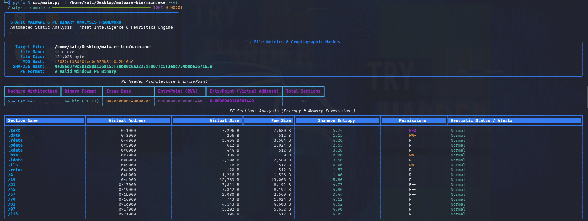
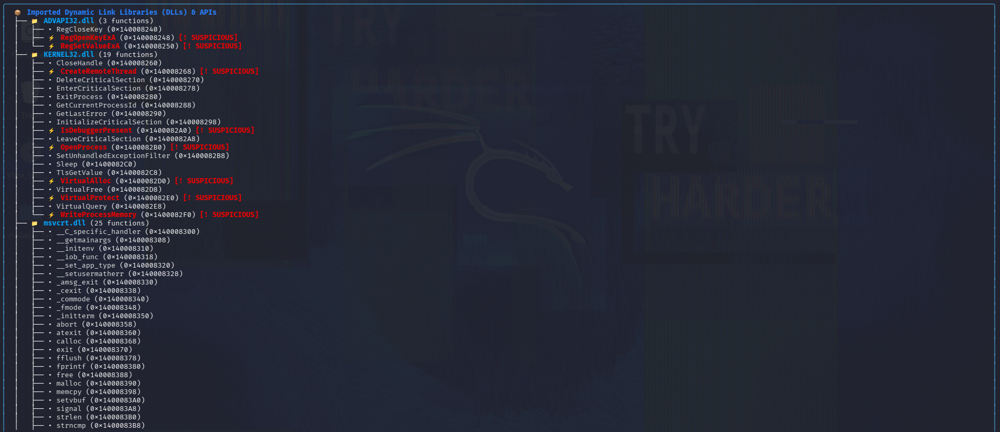
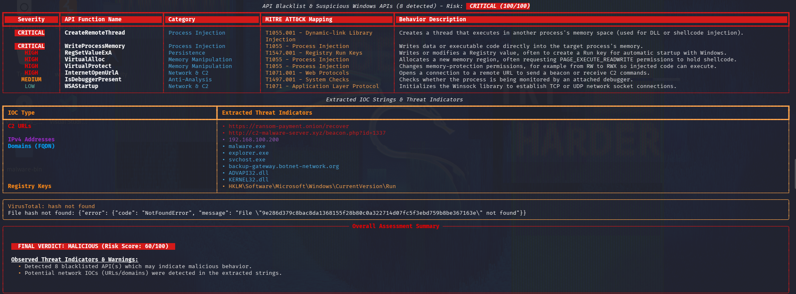

<h1 align="center">MINIPROJECT - PE Analyzer</h1>

<p align="center">
  
  
  
  
  
  
</p>

<p align="center">
  <b>A static malware analysis and Portable Executable (PE) inspection toolkit for fast, offline binary triage.</b>
</p>

---

PE Analyzer helps security researchers, malware analysts, and developers quickly assess suspicious Windows executables without executing them. It parses PE headers and sections, surfaces risky imported APIs, extracts network and string-based indicators of compromise (IOCs), computes hashes for correlation, and produces a structured, shareable report — all from the command line.

> ⚠️ **Safety note:** This tool performs *static* analysis only — it never executes the target binary. Even so, always handle unknown or suspicious samples in an isolated environment (VM, sandbox, or air-gapped system) and follow your organization's malware-handling policy.


---

## Table of Contents

- [Features](#features)
- [How It Works](#how-it-works)
- [Tech Stack](#tech-stack)
- [Getting Started](#getting-started)
- [Usage](#usage)
- [Sample Output](#sample-output)
- [Report Schema](#report-schema)
- [Project Structure](#project-structure)
- [Configuration](#configuration)
- [Testing](#testing)
- [Roadmap](#roadmap)
- [Contributing](#contributing)
- [License](#license)
- [Disclaimer](#disclaimer)

---

## Features

### Core Functionality
- **Header & structure parsing** — validates the DOS/NT headers, optional header, and section table against expected PE structure.
- **Section inspection** — reports per-section entropy, raw/virtual size mismatches, and read/write/execute permission flags to flag packed or self-modifying code.
- **Import/API analysis** — enumerates imported functions and cross-references them against a curated blacklist of APIs commonly abused for process injection, persistence, anti-debugging, and credential access.
- **String & IOC extraction** — pulls printable strings and flags URLs, domains, and IPv4 addresses that may indicate C2 infrastructure or exfiltration endpoints.
- **Hashing** — computes MD5 and SHA-256 for triage, deduplication, and threat-intel correlation.
- **VirusTotal integration (optional)** — looks up the sample's hash reputation via the VT API when a key is supplied.

### Security & Reliability
- Defensive parsing that gracefully handles malformed, truncated, or non-PE input instead of crashing.
- Structured risk scoring that combines entropy, blacklisted imports, and IOC counts into a single at-a-glance verdict.
- Clean, color-coded CLI output (via Rich) plus machine-readable JSON/text export for pipeline integration.
- No network calls unless `--vt` is explicitly passed.

### Performance
- Lightweight, dependency-minimal static analysis workflow.
- Efficient parsing via `pefile`, with an optional fast-path mode for metadata-only inspection on large samples.
- Designed to run comfortably in CI/CD pipelines or batch triage scripts.

---

## How It Works

1. **Load & validate** — the target file is read and validated as a well-formed PE image (MZ/PE signatures, header consistency).
2. **Extract metadata** — compile timestamp, machine type, subsystem, entry point, and section table are parsed.
3. **Score sections** — entropy is calculated per section; high entropy combined with executable+writable permissions is flagged as a packing/obfuscation indicator.
4. **Cross-reference imports** — the import address table is diffed against `utils/blacklist` to surface APIs associated with known malicious behaviors (e.g. `VirtualAllocEx`, `WriteProcessMemory`, `CreateRemoteThread`).
5. **Mine strings** — printable ASCII/UTF-16 strings are extracted and regex-matched for URLs, domains, and IPv4 addresses.
6. **Hash & correlate** — MD5/SHA-256 are computed; if `--vt` is set, the hash is queried against VirusTotal for existing detections.
7. **Report** — findings are aggregated into a risk score and rendered as a Rich terminal report and/or exported to JSON/text.

---

## Tech Stack

| Category | Technology |
| --- | --- |
| Language | Python 3.11 |
| PE Parsing | [`pefile`](https://github.com/erocarrera/pefile) |
| Terminal UI | [`Rich`](https://github.com/Textualize/rich) |
| HTTP Client | `requests` |
| Testing | PyTest |
| Reporting | JSON / plain text exports |

---

## Getting Started

### Prerequisites

Make sure you have the following installed:

- Python 3.11+
- pip
- Git

### Installation

Clone the repository:

```bash
git clone https://github.com/your-username/PE-Analyzer.git
cd PE-Analyzer
python -m venv .venv
```

Activate the virtual environment:

```bash
# Linux / macOS
source .venv/bin/activate

# Windows PowerShell
.venv\Scripts\Activate.ps1
```

Install PE Analyzer in editable mode. This creates the `pe-analyzer` command in the active environment:

```bash
python -m pip install --upgrade pip
python -m pip install -e .
```

Verify the install:

```bash
pe-analyzer --help
```

---

## Usage

Analyze a PE file and display the rich terminal report:

```bash
pe-analyzer samples/windowsAPI.exe
```

Analyze a file and export the report to JSON:

```bash
pe-analyzer samples/windowsAPI.exe -o output/report.json
```

Export a text report (any output extension other than `.json` is written as text):

```bash
pe-analyzer samples/windowsAPI.exe -o output/report.txt
```

Analyze a file and enable VirusTotal hash reputation checking:

```bash
pe-analyzer samples/windowsAPI.exe --vt --api-key YOUR_VT_API_KEY
```

Set a higher minimum printable-string length:

```bash
pe-analyzer samples/windowsAPI.exe --min-len 8
```

Display help:

```bash
pe-analyzer --help
```

> `samples/helloWorld.exe` is an ELF sample despite its `.exe` extension. Use `samples/windowsAPI.exe` or another Windows PE file for PE-analysis examples.

### CLI Reference

| Argument / flag | Description |
| --- | --- |
| `file` | Required positional path to the PE file to analyze |
| `-o, --output` | Path to write the exported report |
| `--vt` | Enable VirusTotal hash lookup |
| `--api-key` | VirusTotal API key (optional override if you do not want to use `.env`) |
| `--min-len` | Minimum printable string length for string extraction (default: `4`) |
| `-h, --help` | Show usage information |

### VirusTotal API Key Setup

For testing or live VT lookups, add the key to a local `.env` file in the project root:

```bash
VT_API_KEY="your_virus_total_api_key_here"
```

With that file in place, the analyzer loads `VT_API_KEY` automatically when `--vt` is enabled.

Or pass it directly on the command line if you want to override the environment for one run:

```bash
pe-analyzer samples/windowsAPI.exe --vt --api-key "your_virus_total_api_key_here"
```

> If `--vt` is enabled without a valid key, the analyzer will attempt to read `VT_API_KEY` from `.env` first and then from the environment, and may report an auth or network error depending on connectivity.

---

## Sample Output

Terminal report (abridged):







---

## Report Schema

Exported JSON reports follow this general shape:

```json
{
  "file": "windowsAPI.exe",
  "hashes": { "md5": "...", "sha256": "..." },
  "headers": { "machine": "AMD64", "timestamp": "...", "entry_point": "0x1000" },
  "sections": [
    { "name": ".text", "entropy": 7.2, "permissions": "RWX", "flagged": true }
  ],
  "imports": {
    "flagged": ["VirtualAllocEx", "WriteProcessMemory", "CreateRemoteThread"],
    "total": 87
  },
  "iocs": { "urls": ["..."], "domains": ["..."], "ips": ["..."] },
  "virustotal": { "detections": 12, "total_engines": 70, "checked": true },
  "risk_score": { "value": 42, "level": "MEDIUM" }
}
```

---

## Project Structure

```text
PE-Analyzer/
├── docs/                     # Project notes and analysis documentation
├── img/                      # Picture in README.md
├── output/                   # Generated analysis reports
├── samples/                  # Sample PE binaries and demonstration files
├── src/                      # Application source code
│   ├── core/                 # PE parsing and hashing logic
│   ├── services/             # External services such as VT integration
│   ├── utils/                # Blacklist, display, and utility helpers
│   └── main.py                # CLI entry point
├── tests/                    # Automated tests
├── LICENSE                    # Project license
├── README.md                  # Project overview and usage
├── pyproject.toml             # Package metadata and pe-analyzer CLI entry point
├── requirements.txt           # Python dependencies
└── .gitignore                 # Git ignore rules
```

---

## Configuration

VirusTotal API key can be provided via a local `.env` file, a CLI flag, or an environment variable:

```bash
VT_API_KEY="your_api_key_here"
```

With that file in the project root, the analyzer will load the key automatically when `--vt` is enabled.

For testing in a local shell, you can still pass the key directly:

```bash
pe-analyzer samples/windowsAPI.exe --vt --api-key "your_api_key_here"
```

If you prefer shell environment variables, that still works too:

```bash
export VT_API_KEY="your_api_key_here"
pe-analyzer samples/windowsAPI.exe --vt
```

The blacklist of risky Windows APIs used for import scoring lives in `src/utils/` and can be extended with additional entries as needed.

---

## Testing

Run the test suite with PyTest:

```bash
pip install -r requirements-dev.txt   # if separated from main requirements
pytest tests/ -v
```

Generate a coverage report:

```bash
pytest --cov=src tests/
```

---

## Roadmap

- [ ] YARA rule integration for signature-based matching
- [ ] PE resource and overlay extraction
- [ ] Digital signature / Authenticode verification
- [ ] HTML report export
- [ ] Docker image for sandboxed, reproducible analysis

---

## Contributing

Contributions are welcome. To contribute:

1. Fork the repository.
2. Create a feature branch (`git checkout -b feature/your-feature`).
3. Commit your changes with a clear message.
4. Push the branch and open a pull request.

Please run the test suite before submitting a PR.

---

## License

This project is distributed under the MIT License. See [LICENSE](LICENSE) for more information.

## Disclaimer

PE Analyzer is intended strictly for legitimate security research, malware triage, and educational purposes on samples you are authorized to analyze. The authors are not responsible for misuse of this tool.

---

Built for static malware triage, PE structure inspection, and fast IOC extraction.
