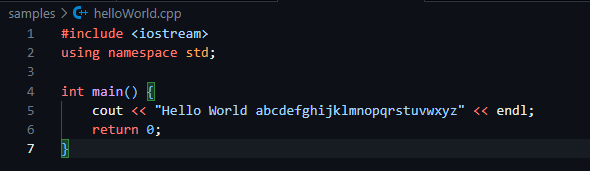
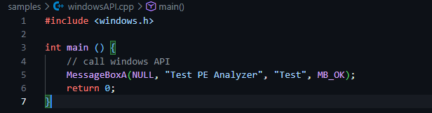
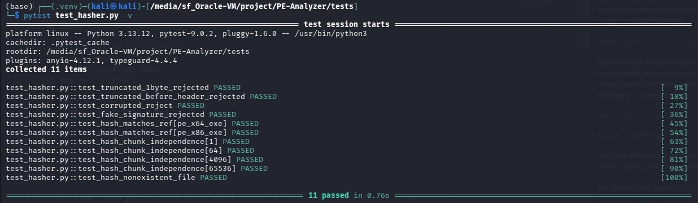

# PROJECT'S CHECKPOINT - WEEK 1

## Nhiệm vụ cụ thể

### Khởi tạo và thiết lập môi trường
- Hoàn thành thiết lập môi trường ảo Python (`.venv`) và cài đặt các thư viện phụ thuộc theo kế hoạch (`pytest`, `pefile`, `requests`, `rich`)
- Cài đặt bộ biên dịch chéo `mingw-64` nhằm hỗ trợ biên dịch `C/C++` trong việc tạo sample mẫu để test Module.

### Phát triển C++ Executable Samples
- Hoàn thành mã nguồn C++ và biên dịch 2 mẫu thực thi sạch làm dữ liệu kiểm thử:

    - `samples/helloWorld.cpp`:

        

    - `samples/windowsAPI.cpp`:

        

### Phát triển Module và chạy kiểm thử tự động
- Hoàn thành phát triển 2 Module:

    - `src/core/pe_checker.py`: Thực hiện `PE_checker()` kiểm tra header `MZ` (Quick Check) và offset `e_lfanew` đến chữ ký `PE\0\0` (Full Check).
    - `src/core/hasher.py`: Thực hiện hàm `calculate_hash()` tính mã MD5 và SHA-256 theo cơ chế đọc-theo-chunk nhị phân, đảm bảo không tràn RAM với file dung lượng lớn.
    - `src/core/__init__.py`: Package hóa module, export các interface chính

- Chạy kiểm thử tự động: 

    - Tạo `tests/conftest.py` nhằm xây dựng các fixture nạp file `.exe` mẫu và tự động sinh các dạng file biến đổi lỗi (1-byte file, corrupted MZ header, truncated PE, fake PE signature, fake text file).
    - Tạo `tests/test_hasher.py` nhằm kiểm thử tính chính xác của hash, khả năng phát hiện file giả mạo và tính độc lập của hash đối với tham số `chunk_size`.

- Kết quả chạy kiểm tra với `pytest`: **THÀNH CÔNG 100%**

    