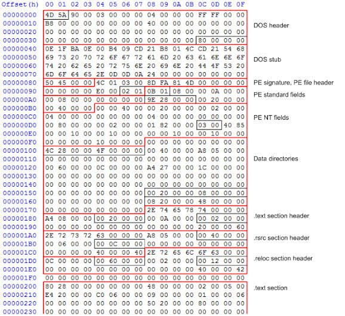
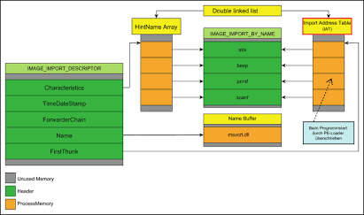
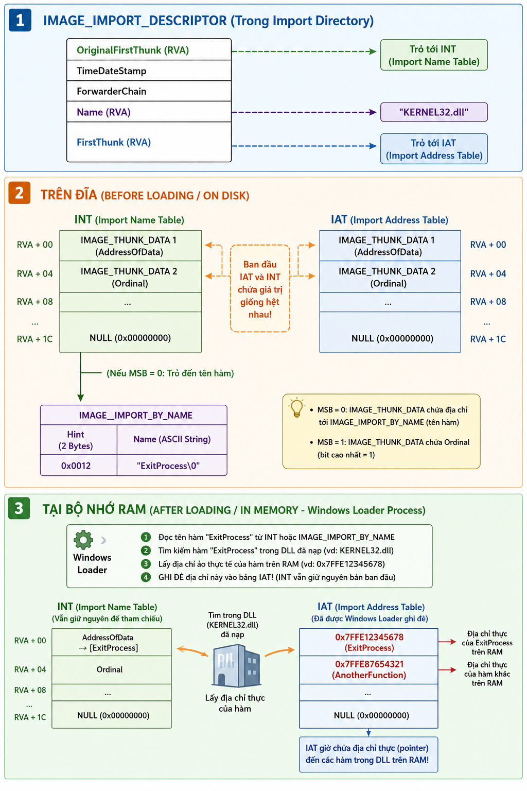

# TÌM HIỂU VỀ CẤU TRÚC PE FILE

## Tổng quan về định dạng PE

### Khái niệm PE file
- PE file format (Portable Executable File Format) là một định dạng file riêng của Win32. Tất cả các dạng file có thể chạy và thực thi trên Win32 như `.exe`, `.dll`,... đều là định dạng PE. 
- File PE được chia làm hai phần **Header** và **Section**, trong đó **Header** có vai trò lưu các giá trị định dạng file và các offset của các section trong phần **Section**.

### Vai trò của PE file
PE đóng vai trò nền tảng trong kiến trúc hệ điều hành Windows, cung cấp một tiêu chuẩn cho các đối tượng thực thi như file `.exe`, `.dll`, `.sys`. Đặt trên nền tảng kế thừa và phát triển từ định dạng **COFF** (Common Object File Format) của Unix, cấu trúc PE được mở rộng nhằm tối ưu hóa tính linh hoạt và khả năng tương thích hệ thống (Microsoft Corporation, 2018). Vai trò của PE file được thể hiện qua các khía cạnh kỹ thuật cốt lõi sau:

- **Chuẩn hóa quy trình thực thi:** PE file thiết lập một giao thức thống nhất cho việc khởi tạo tiến trình. Hệ thống thông tin trong các tiêu đề (Headers)—như `Magic Number`, `Machine Type`, và `Subsystem`—cung cấp cho bộ tải hệ điều hành (OS Loader) các dữ liệu nguyên thủy cần thiết để xác thực tính hợp lệ và cấu hình môi trường chạy phù hợp (Russinovich et al., 2012).
- **Tổ chức và quản lý bộ nhớ ảo:** PE file triển khai mô hình phân đoạn (section-based layout) nhằm phân định rõ ràng mã máy (`.text`), dữ liệu khởi tạo (`.data`), và tài nguyên nhúng (`.rsrc`). Kiến trúc này không chỉ tối ưu hóa việc định tuyến bộ nhớ mà còn cho phép OS Loader áp dụng các đặc tính phân quyền truy cập (Read/Write/Execute) riêng biệt cho từng phân vùng theo thuộc tính chức năng của chúng (Eilam, 2011; Perriot & Ferrie, 2004).
- **Định vị và định tuyến địa chỉ linh hoạt:** Thông qua việc sử dụng các chỉ số Địa chỉ Virtual Tương đối (Relative Virtual Address - RVA) kết hợp với Bảng tái định vị (Relocation Table), PE file đóng vai trò như một bản chỉ dẫn kỹ thuật. Cơ chế này cho phép OS Loader điều chỉnh các tham chiếu địa chỉ tuyệt đối trong mã máy tại thời điểm nạp (runtime load) khi hình ảnh tệp không thể đặt tại địa chỉ ưu tiên (`ImageBase`), đảm bảo tính toàn vẹn của tiến trình (Kuacharoen, 2009).
- **Điều phối liên kết động và tính mô-đun:** PE file duy trì cấu trúc Bảng nhập địa chỉ (Import Address Table - IAT) và Bảng xuất (Export Table). Mô hình này cho phép các ứng dụng chia sẻ tài nguyên mã nguồn, giảm thiểu dung lượng lưu trữ, và tạo nền tảng cho hệ sinh thái thư viện chia sẻ (DLL) của Windows (Anderson, 2012; Sikorski & Honig, 2012).
- **Tích hợp các cơ chế an ninh cấp thấp:** Bản thân cấu trúc PE được thiết kế để hỗ trợ trực tiếp các tính năng bảo mật của phần cứng và kernel, bao gồm Bảng chữ ký số (Digital Signature Table), ngăn chặn thi hành mã trên vùng dữ liệu (Data Execution Prevention - DEP), và ngẫu nhiên hóa sơ đồ không gian địa chỉ (Address Space Layout Randomization - ASLR). Sự tích hợp này tạo thành lớp phòng thủ cơ sở chống lại các kỹ thuật khai thác như tràn bộ đệm (buffer overflow) hay chèn mã độc (code injection) (Szor, 2005; Johnson & Keromytis, 2011).

## Cấu trúc của PE File


Ở mức cơ bản, một PE file gồm có 2 phần: đoạn mã (code) và dữ liệu (data). Một chương trình hay ứng dụng chạy trên nền tảng Windows NT gồm có 9 sections được xác định trước, bao gồm `.text`, `.bss`, `.data`, `.rdata`, `.rsrc`, `.edata`, `.idata`, `.pdata` , và `.debug.`. Tuy nhiên không phải chương trình nào cũng cần đủ 9 sections này, và đa số chương trình sẽ được định nghĩa với nhiều sections hơn để phù hợp với cách sử dụng của chúng.

Cấu trúc của một file PE trên đĩa và khi được nạp vào bộ nhớ RAM có sự tương đồng lớn về các thành phần, nhưng không hoàn toàn giống hệt nhau.

Windows Loader sẽ quyết định phần dữ liệu nào cần được ánh xạ (map) vào bộ nhớ và phần nào có thể bỏ qua. Những dữ liệu không được ánh xạ vào RAM (chẳng hạn như Debug Information) thường được đặt ở cuối file trên đĩa.

Vị trí (offset) của các dữ liệu trong file trên đĩa sẽ khác với địa chỉ của chúng khi nằm trong RAM vì cơ chế quản lý bộ nhớ ảo dựa trên trang (Paging) của Windows:

- **Căn chỉnh trang (Section Alignment)**: Khi nạp các section vào RAM, hệ thống căn chỉnh chúng theo kích thước trang bộ nhớ (thường là 4KB). Mỗi section sẽ bắt đầu ở một trang bộ nhớ mới.

- **Cấp phát bộ nhớ**: Một trường trong PE Header (SizeOfImage) sẽ thông báo cho hệ điều hành biết tổng dung lượng bộ nhớ ảo cần cấp phát để ánh xạ toàn bộ file PE vào RAM.

### Header

#### DOS Header
Tất cả các PE file đều bắt đầu bằng **DOS Header** (IMAGE_DOS_HEADER), có kích thước cố định **64 bytes** (`0x40` bytes).

Mục đích chính của **DOS Header** là đảm bảo khả năng tương thích ngược (backward compatibility) với hệ điều hành MS-DOS 16-bit cổ điển, đồng thời cung cấp điểm neo dẫn tới cấu trúc thực thi Windows thực sự (NT Headers).

**DOS Header** là một cấu trúc được định nghĩa trong `windows.inc` hoặc `winnt.h`, gồm 19 thành phần (members):

```c++
typedef struct _IMAGE_DOS_HEADER {
    WORD  e_magic;      // Magic number ("MZ" - 0x5A4D) - OFFSET: 0x00
    WORD  e_cblp;       // Bytes on last page of file   - OFFSET: 0x02
    WORD  e_cp;         // Pages in file    - OFFSET: 0x04
    WORD  e_crlc;       // Relocations  - OFFSET: 0x06
    WORD  e_cparhdr;    // Size of header in paragraphs - OFFSET: 0x08
    WORD  e_minalloc;   // Minimum extra paragraphs needed  - OFFSET: 0x0a
    WORD  e_maxalloc;   // Maximum extra paragraphs needed  - OFFSET: 0x0c
    WORD  e_ss;         // Initial (relative) SS value  - OFFSET: 0x0c
    WORD  e_sp;         // Initial SP value - OFFSET: 0x10
    WORD  e_csum;       // Checksum - OFFSET: 0x12
    WORD  e_ip;         // Initial IP value - OFFSET: 0x14
    WORD  e_cs;         // Initial (relative) CS value  - OFFSET: 0x16
    WORD  e_lfarlc;     // File address of relocation table - OFFSET: 0x18
    WORD  e_ovno;       // Overlay number   - OFFSET: 0x1a
    WORD  e_res[4];     // Reserved words   - OFFSET: 0x1c
    WORD  e_oemid;      // OEM identifier (for e_oeminfo)   - OFFSET: 0x24
    WORD  e_oeminfo;    // OEM information; e_oemid specific    - OFFSET: 0x26
    WORD  e_res2[10];   // Reserved words   - OFFSET: 0x28
    LONG  e_lfanew;     // File address of new exe header (NT Headers)  - OFFSET: 0x3c
} IMAGE_DOS_HEADER, *PIMAGE_DOS_HEADER;
```

Trong đó có 2 trường mang giá trị quyết định với Windows OS hiện đại và các Reverse Engineering Tool:

- `e_magic` (2 bytes - OFFSET `0x00`):

    - Trường này được gọi là **Magic Number** hoặc **DOS Signature**.
    - Giá trị của trường này luôn là `0x5A4D` tương ứng với 2 kí tự ASCII **"MZ"**
    - Windows Loader sẽ dựa vào 2 bytes này (`0x5a` và `0x4d`) để xác định đây có phải là một file thực thi hợp lệ hay không

    

- `e_lfanew` (4 bytes - OFFSET `0x3c`):

    - Trường nằm cuối của DOS Header
    - Chứa **File Offset** (địa chỉ con trỏ) trỏ trực tiếp đến điểm bắt đầu của NT Headers.
    - Đây là trường quan trọng nhất giúp OS Loader bỏ qua phần dữ liệu DOS dư thừa để đọc thông tin nạp file 32-bit/64-bit.

Giá trị `DWORD` cuối cùng trước điểm bắt đầu DOS Stub chứa những giá trị `00 01 00 00`. Để ý đến trật tự byte, điều này giúp ta biết `00 00 01 00h` là những offset nơi mà PE Header bắt đầu. PE Header bắt đầu với phần signatures của nó là `50h, 45h, 00h, 00h` (Các kí tự “PE” được đi kèm bới các giá trị tận cùng là 0)


#### NT Header

NT Header hay `IMAGE_NT_HEADERS` là cấu trúc quan trọng nhất trong PE Header, đóng vai trò như "bộ não" chứa toàn bộ thông tin vận hành cốt lõi mà Windows Loader cần để nạp một tệp thực thi vào bộ nhớ (RAM).

Địa chỉ của `IMAGE_NT_HEADERS` được tính theo công thức:

$$Address = BaseAddress + Offset$$

Trong đó: $BaseAddress$ - địa chỉ gốc của file được lưu tại trường `e_lfanew`trong DOS Header

Tuỳ vào kiến trúc PE32 hay PE32+ (tương ứng với tệp 32-bit hay 64-bit), cấu trúc này sẽ được định nghĩa theo cách khác nhau. Cụ thể:

- Đối với `PE32`:
    ```c++
    typedef struct _IMAGE_NT_HEADERS {
        DWORD Signature;                    // PE Signature ("PE\0\0")
        IMAGE_FILE_HEADER FileHeader;       // Thông tin tổng quan file
        IMAGE_OPTIONAL_HEADER32 OptionalHeader; // Thông tin nạp bộ nhớ & cấu trúc dữ liệu
    } IMAGE_NT_HEADER32, *PIMAGE_NT_HEADER;
    ```

- Đối với `PE32+`:
    ```c++
    typedef struct _IMAGE_NT_HEADERS64 {
        DWORD Signature;                    // PE Signature ("PE\0\0")
        IMAGE_FILE_HEADER FileHeader;       // Thông tin tổng quan file
        IMAGE_OPTIONAL_HEADER64 OptionalHeader; // Thông tin nạp bộ nhớ & cấu trúc dữ liệu
    } IMAGE_NT_HEADERS64, *PIMAGE_NT_HEADERS64;
    ```

Trong đó:
- 4 bytes `Signature` giữ giá trị cố định `0x00004550` (đổi sang ASCII text là `PE\0\0`) được dùng để xác định đây là một NT headers hợp lệ.
- 20 bytes `FileHeader` dùng để chứa thông tin cấu hình vật lý của file, bao gồm:

    ```c++
    typedef struct _IMAGE_FILE_HEADER {
        WORD Machine;
        WORD NumberOfSections;
        ULONG TimeDateStamp;
        ULONG PointerToSymbolTable;
        ULONG NumberOfSymbols;
        WORD SizeOfOptionalHeader;
        WORD Characteristics;
    } IMAGE_FILE_HEADER, *PIMAGE_FILE_HEADER;
    ```
    
    - `Machine`: Xác định kiến trúc phần cứng
    - `NumberOfSections`: Số lượng các section (`.text`, `.data`, `.rsrc`...). Loader dùng thông tin này để biết có bao nhiêu Section Header ở ngay sau NT Header.
    - `TimeDateStamp`: Đấu mốc thời gian file được biên dịch (Epoch time).
    - `SizeOfOptionalHeader`: Kích thước của `OptionalHeader` đi ngay sau nó (thường là `0xE0` cho 32-bit và `0xF0` cho 64-bit).
    - `Characteristics`: Cờ hiệu trạng thái file (VD: `0x0002` = Executable, `0x2000` = DLL file).

- 224 bytes `OptionalHeader` chứa thông tin về Logic bên trong của PE file, đồng thời đây là phần quan trọng nhất quyết định cách data được nạp lên RAM

    

    - **AddressOfEntryPoint – RVA** (địa chỉ ảo tương đối) là khoảng cách (offset) từ địa chỉ nạp gốc (`ImageBase`) đến một vị trí dữ liệu hoặc lệnh trong RAM Memory. Nếu như muốn làm thay đổi luồng của thứ tự thực hiện, cần phải thay đổi lại giá trị trong trường này thành một RVA mới và do đó câu lệnh tại giá trị RVA mới này sẽ được thực thi đầu tiên. Công thức:

    $$VA = ImageBase + RVA$$

    - **ImageBase** (địa chỉ nạp được ưu tiên). Giá trị của address này là mặc định. Cụ thể, đối với tệp `.exe` 32-bit thường là `0x00400000`, 64-bit là `0x0000000140000000`. Với tệp `.dll` thường là `0x10000000`.

        > Cơ chế ASLR (Address Space Layout Randomization): Nếu cờ bảo mật ASLR được bật (hoặc địa chỉ ImageBase bị xung đột với ứng dụng khác), Windows Loader sẽ nạp tệp vào một địa chỉ ảo ngẫu nhiên khác. Lúc này, hệ thống phải dựa vào bảng .reloc để tính toán lại địa chỉ thực tế.

    - **SectionAlignment** (Độ căn chỉnh bộ nhớ ảo). Field này có nhiệm vụ quy định kích thước khối bộ nhớ tối thiểu khi từng Section được ánh xạ lên RAM.

        - Giá trị phổ biến: `0x1000` bytes (4 KB) - đúng bằng kích thước 1 trang Memory Page trên kiến trúc `x86/64`
        - Cơ chế: Nếu một Section có kích thước dữ liệu thực tế chỉ là 1.5 KB, Windows Loader vẫn phải cấp phát trọn vẹn 4 KB trên RAM cho Section đó. Phần dư thừa còn lại sẽ được chèn các byte trống (`0x00` - Padding). 

    - **SizeOfImage** xác định tổng dung lượng bộ nhớ ảo (RAM) mà Windows Loader phải đặt trước (reserve) để chứa toàn bộ PE File (bao gồm cả Headers và tất cả các Sections). Công thức:

        $$SizeOfImage = \sum (\text{Kích thước các Section đã căn chỉnh theo } SectionAlignment) + PE\_Header$$

#### Data Directory
**DataDirectory** là 128 bytes cuối cùng của **OptionalHeader**, và lần lượt là những thành phần cuối cùng của `IMAGE_NT_HEADERS`. Đây là một mảng của 16 cấu trúc `IMAGE_DATA_DIRECTORY` structures, mỗi 8 bytes thì mỗi phần lại có liên quan đến một CTDL trong PE File. Cấu trúc của Data Directory có 2 thành phần mà bao gồm thông tin về vị trí và kích thước của cấu trúc dữ liệu:

```c++
typedef struct _IMAGE_DATA_DIRECTORY {
    DWORD VirtualAddress; // Địa chỉ RVA trỏ đến bảng dữ liệu
    DWORD Size;           // Kích thước của bảng dữ liệu (bytes)
} IMAGE_DATA_DIRECTORY, *PIMAGE_DATA_DIRECTORY;
```

- `VirtualAddress`: Địa chỉ ảo tương đối của cấu trúc (RVA)
- `Size`: kích thước của CTDL (Tính theo bytes)

16 directories mà cấu trúc này tham chiếu đến được định nghĩa trong `window.inc`, trong đó có 4 trường quan trọng:

- `IMAGE_DIRECTORY_ENTRY_BASERELOC` - `DataDirectory[5]`: Base Relocation Table
- `IMAGE_DIRECTORY_ENTRY_EXPORT` - `DataDirectory[0]`: Export Directory
- `IMAGE_DIRECTORY_ENTRY_IAT` - `DataDirectory[12]`: Import Address Table
- `IMAGE_DIRECTORY_ENTRY_IMPORT` - `DataDirectory[1]`: Import Directory

Dưới đây là hình ảnh Hex View thực tế phân tích cấu trúc PE Header, bao gồm vùng chứa mảng Data Directories:



#### Import Directory



Import Directory là một mảng các cấu trúc `IMAGE_IMPORT_DESCRIPTOR`, trong đó mỗi phần tử tương ứng với một **DLL** mà PE File phụ thuộc (ví dụ: kernel32.dll, user32.dll).

Kích thước của mỗi phần tử IID là **20 bytes**. Mảng này kết thúc bằng một phần tử rỗng (NULL Structure — tất cả các trường đều bằng 0).

Cấu trúc `IMAGE_IMPORT_DESCRIPTOR` trong `winnt.h`:

```c++
typedef struct _IMAGE_IMPORT_DESCRIPTOR {
    union {
        DWORD   Characteristics;            // 0 for terminating null entry
        DWORD   OriginalFirstThunk;         // RVA trỏ đến Import Name Table (INT)
    } DUMMYUNIONNAME;
    DWORD   TimeDateStamp;                  // 0 nếu không Bound Import; -1 nếu Bound
    DWORD   ForwarderChain;                 // Index cho các hàm Forwarder
    DWORD   Name;                           // RVA trỏ đến chuỗi ASCII chứa tên DLL
    DWORD   FirstThunk;                     // RVA trỏ đến Import Address Table (IAT)
} IMAGE_IMPORT_DESCRIPTOR, *PIMAGE_IMPORT_DESCRIPTOR;
```

Trong đó:

- Trường `OriginalFirstThunk` (RVA): Trỏ tới **Import Name Table (INT)** hay còn được gọi là **Import Lookup Table (ILT)**. Đây là mảng các con trỏ thực hiện trở đến các hàm cần import.
- Trường `Name` (RVA): Trỏ đến chuỗi ASCII kết thúc bằng byte `0` chứa tên của DLL
- Trường `FirstThunk` (RVA): Trỏ tới **Import Address Table (IAT)**. Cụ thể:
    - Trên ổ cứng (Disk): `FirstThunk` chứa dữ liệu song song và giống hệt `OriginalFirstThunk`
    - Trên bộ nhớ (RAM): Sau khi Windows Loader nạp chương trình, các giá trị trong IAT tại `FirstThunk` sẽ bị ghi đè bằng địa chỉ ảo VA thực tế của các hàm API trong bộ nhớ.
- `TimeDateStamp`: Nếu bằng `0`, DLL chưa được Bound. Nếu bằng `-1`, DLL đã được Bound trước (Bound Import).
- `ForwarderChain`: Dùng khi hàm được forward từ DLL này sang DLL khác (hiếm khi phân tích thủ công).

##### INT và IAT

Cả **INT** và **IAT** đều là các con trỏ kiểu `IMAGE_THUNK_DATA` Mảng này được kết thúc bằng một phần tử `0` và có kích thước 4 bytes (đối với `PE32`) và 8 bytes (đối với `PE32+`):

```c++
typedef struct _IMAGE_THUNK_DATA32 {
    union {
        DWORD ForwarderString;      // PBYTE 
        DWORD Function;             // PDWORD địa chỉ hàm (trên RAM)
        DWORD Ordinal;              // Import theo Ordinal (chỉ số)
        DWORD AddressOfData;        // RVA trỏ đến IMAGE_IMPORT_BY_NAME
    } u1;
} IMAGE_THUNK_DATA32;
```

Cơ chế Import:

- **Import By Name**: Nếu bit MSB của Thunk Data là 0 thì giá trị đó là một RVA trỏ tới cấu trúc `IMAGE_IMPORT_BY_NAME`. Cấu trúc này được định nghĩa như sau:
    ```c++
    typedef struct _IMAGE_IMPORT_BY_NAME {
        WORD    Hint;          // Chỉ số gợi ý trong Export Table của DLL
        CHAR    Name[1];       // Chuỗi ASCII chứa tên hàm (kết thúc bằng NULL)
    } IMAGE_IMPORT_BY_NAME, *PIMAGE_IMPORT_BY_NAME;
    ```

    - `Hint` (2 bytes): Chỉ số gợi ý vị trí của hàm trong Export Directory Table của DLL đích. Giúp Windows Loader tìm kiếm hàm nhanh hơn thay vì phải duyệt toàn bộ bảng tên.
    - `Name`: Chuỗi ký tự ASCII kết thúc bằng `NULL` biểu diễn tên hàm
- **Import By Ordinal**: Nếu bit MSB của Thunk Data là 1 thì hàm đó được import bằng số thứ tự (Ordinal). Giá trị Ordinal nằm ở các bit thấp.

##### Tổng quan cơ chế Import Table



**Tóm tắt flow xử lý**
```
               ┌───────────────────────────────┐
               │    IMAGE_THUNK_DATA Value     │
               └───────────────┬───────────────┘
                               │
                       Bit MSB là 0 hay 1?
                      /                 \
            MSB = 0  /                   \  MSB = 1
                    ▼                     ▼
         [Import By Name]              [Import By Ordinal]
        ----------------              --------------------
        Giá trị là RVA trỏ             Các bit thấp chứa trực tiếp
        tới cấu trúc                   mã số thứ tự (Ordinal) 
        IMAGE_IMPORT_BY_NAME.          của hàm trong DLL.
```

### Section Table
**Section Table** (hay còn gọi là **Section Headers**) là mảng chứa thông tin quản lý toàn bộ các phân vùng dữ liệu (Sections) trong cấu trúc Portable Executable (PE) của hệ điều hành Windows. Nó nằm ngay sau PE Header (kế tiếp `IMAGE_OPTIONAL_HEADER`) và đóng vai trò như một "bản đồ" hướng dẫn Windows PE Loader nạp dữ liệu từ file trên đĩa vào bộ nhớ RAM.

Mỗi section trong file được mô tả bởi một phần tử kiểu `IMAGE_SECTION_HEADER` có kích thước cố định là **40 bytes** (0x28 bytes). Số lượng phần tử trong Section Table được xác định chính xác bởi trường `NumberOfSections` trong `IMAGE_FILE_HEADER`.

Cấu trúc này được định nghĩa như sau:
```c++
typedef struct _IMAGE_SECTION_HEADER {
    BYTE  Name[IMAGE_SIZEOF_SHORT_NAME]; // 8 bytes: Tên section (UTF-8/ASCII)
    union {
        DWORD PhysicalAddress;
        DWORD VirtualSize;               // Kích thước section khi nạp vào RAM
    } Misc;
    DWORD VirtualAddress;                // Địa chỉ RVA của section trên RAM
    DWORD SizeOfRawData;                 // Kích thước section trên đĩa (Disk)
    DWORD PointerToRawData;              // File Offset (vị trí section trên đĩa)
    DWORD PointerToRelocations;          // Offset tới thông tin Relocation (COFF)
    DWORD PointerToLinenumbers;          // Offset tới thông tin dòng mã nguồn (Debug)
    WORD  NumberOfRelocations;           // Số lượng entry trong bàn Relocation
    WORD  NumberOfLinenumbers;            // Số lượng dòng mã nguồn
    DWORD Characteristics;               // Cờ thuộc tính (Read, Write, Execute,...)
} IMAGE_SECTION_HEADER, *PIMAGE_SECTION_HEADER;
```

| Trường | Kích thước | Mô tả chi tiết |
| --- | --- | --- |
| **`Name`** | 8 Bytes | Chuỗi ASCII không bắt buộc có ký tự kết thúc `\0` nếu dùng đủ 8 ký tự. Tên thường bắt đầu bằng dấu chấm (ví dụ: `.text`, `.data`). |
| **`VirtualSize`** | 4 Bytes | Kích thước thực tế của section khi nằm trên bộ nhớ RAM. Nếu `VirtualSize` lớn hơn `SizeOfRawData`, phần dung lượng chênh lệch sẽ được điền bằng byte `0x00` (thường thấy ở phần `.bss`). |
| **`VirtualAddress`** | 4 Bytes | Địa chỉ ảo tương đối (**RVA - Relative Virtual Address**) nơi Windows Loader đặt section này trên RAM. Giá trị này luôn là bội số của `SectionAlignment`. |
| **`SizeOfRawData`** | 4 Bytes | Dung lượng của section trên đĩa. Giá trị này được làm tròn theo cờ `FileAlignment` trong `IMAGE_OPTIONAL_HEADER`. |
| **`PointerToRawData`** | 4 Bytes | Vị trí bắt đầu của section tính từ đầu file (`File Offset` / `RAW Offset`). |
| **`Characteristics`** | 4 Bytes | Tập hợp các cờ bit xác định quyền truy cập (Read, Write, Execute) và bản chất của dữ liệu (Code, Uninitialized Data, Initialized Data). |

#### Các flag `Characteristics` quan trọng trong PE file
Giá trị 32-bit của `Characteristics` xác định hành vi của bộ nhớ do hệ điều hành quản lý:

* **`IMAGE_SCN_CNT_CODE`** (`0x00000020`): Section chứa mã lệnh thi hành.
* **`IMAGE_SCN_CNT_INITIALIZED_DATA`** (`0x00000040`): Section chứa dữ liệu đã khởi tạo.
* **`IMAGE_SCN_CNT_UNINITIALIZED_DATA`** (`0x00000080`): Section chứa dữ liệu chưa khởi tạo.
* **`IMAGE_SCN_MEM_EXECUTE`** (`0x20000000`): Cấp quyền thi hành (`Execute`) mã lệnh trong section.
* **`IMAGE_SCN_MEM_READ`** (`0x40000000`): Cấp quyền đọc (`Read`) dữ liệu trong section.
* **`IMAGE_SCN_MEM_WRITE`** (`0x80000000`): Cấp quyền ghi (`Write`) vào section.

### Section
PE File Sections là những section chứa nội dung chính của file, bao gồm code, data, resource và những thông tin khác của file thực thi. Mỗi section có một Header và một body. Những Section Headers thì được chứa trong Section Table ta vừa phân tích nhưng những Section Bodies lại không có cấu trúc, chúng có thể được sắp xếp theo bất kì cách nào với điều kiện là Header được điều thông tin đầy đủ để có thể giải mã dữ liệu.

Các Sections chuẩn phổ biến trong PE file:
* **`.text`**: Chứa mã máy thi hành (Machine Code) của chương trình (`READ | EXECUTE`).
* **`.data`**: Chứa các biến toàn cục và biến tĩnh đã được khởi tạo giá trị (`READ | WRITE`).
* **`.rdata`**: Chứa dữ liệu chỉ đọc như hằng số, chuỗi ký tự cố định và bảng **Import Directory Table** (`READ`).
* **`.bss`**: Chứa các biến toàn cục chưa được khởi tạo. Không chiếm không gian thực trên ổ đĩa (`SizeOfRawData = 0`).
* **`.rsrc`**: Chứa tài nguyên đi kèm của ứng dụng như icon, hình ảnh, chuỗi đa ngôn ngữ, dialog.
* **`.reloc`**: Bảng thông tin Base Relocation giúp chương trình chạy đúng khi không thể nạp vào đúng địa chỉ `ImageBase` mặc định (mecanism ASLR).
* **`.idata` / `.edata**`: Lần lượt chứa thông tin các hàm Import (nhập từ DLL) và Export (xuất hàm ra bên ngoài).


### Thuật toán chuyển đổi RVA sang File Offset (RAW)

Trong quá trình phân tích tĩnh (Static Analysis) hoặc Reverse Engineering, việc chuyển đổi từ địa chỉ RVA trên RAM sang File Offset trên ổ đĩa là thao tác cốt lõi:

1. Duyệt qua mảng Section Table để tìm section chứa địa chỉ RVA thỏa mãn:

$$\text{VirtualAddress} \le \text{RVA} < \text{VirtualAddress} + \text{VirtualSize}$$


2. Tính khoảng cách vị trí tương đối (**Delta**) trong section:

$$\Delta = \text{RVA} - \text{VirtualAddress}$$


3. Tính địa chỉ File Offset tương ứng trên đĩa:

$$\text{RAW} = \text{PointerToRawData} + \Delta$$