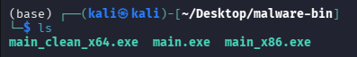

# HƯỚNG DẪN BIÊN DỊCH & KIỂM THỬ MẪU PE C/C++ (COMPILATION & TEST GUIDE)

Tài liệu này hướng dẫn cách cài đặt trình biên dịch chéo (**MinGW-w64**), biên dịch mã nguồn C/C++ trong thư mục `samples/malware-simulator/` thành các tệp thực thi Windows PE (`.exe` 32-bit & 64-bit), và chạy toàn bộ pipeline phân tích tĩnh mã độc.

## 1. Cài đặt môi trường biên dịch (Prerequisites)

Để biên dịch mã nguồn C/C++ thành file thực thi Windows (`PE .exe`) trên môi trường Linux/Ubuntu/Debian, cần cài đặt bộ công cụ biên dịch chéo **MinGW-w64**:

```bash
# Cập nhật package manager và cài đặt MinGW-w64
sudo apt-get update -y
sudo apt-get install -y mingw-w64 g++-mingw-w64 gcc-mingw-w64
```

> **Ghi chú trên các hệ điều hành khác:**
> - **macOS:** `brew install mingw-w64`
> - **Windows:** Cài đặt trực tiếp qua `MSYS2` (`pacman -S mingw-w64-x86_64-toolchain`) hoặc Visual Studio C++ Compiler (`cl.exe`).

---

## 2. Biên dịch chi tiết (Compilation Commands)

Tạo script chạy biên dịch tự động:

```bash
set -e

SCRIPT_DIR="$(cd "$(dirname "$0")" && pwd)"
OUTPUT_DIR="/home/kali/Desktop/malware-bin"

mkdir -p "$OUTPUT_DIR"

echo "[+] Đang biên dịch Malware Simulator (64-bit PE)..."
x86_64-w64-mingw32-g++ "$SCRIPT_DIR/main.cpp" -o "$OUTPUT_DIR/main.exe" -lwininet -lws2_32 -O2

echo "[+] Đang biên dịch Malware Simulator (32-bit PE)..."
i686-w64-mingw32-g++ "$SCRIPT_DIR/main.cpp" -o "$OUTPUT_DIR/main_x86.exe" -lwininet -lws2_32 -O2

echo "[+] Đang biên dịch Clean Benchmark Application (64-bit PE)..."
x86_64-w64-mingw32-gcc "$SCRIPT_DIR/main_clean.c" -o "$OUTPUT_DIR/main_clean_x64.exe" -O2

echo ""
echo "[✓] Biên dịch thành công toàn bộ file mẫu tại thư mục: $OUTPUT_DIR"
ls -lh "$OUTPUT_DIR"
```

Tạo folder trên máy ảo theo đường dẫn `OUTPUT_DIR`

Chạy script tự động đã tạo sẵn:

```bash
chmod +x build_samples.sh
./build_samples.sh
```

Sau khi chạy xong có 3 file như hình:



#### Giải thích các tham số biên dịch:
- `-lwininet`: Liên kết với thư viện `WININET.dll` (hỗ trợ `InternetOpenUrlA`).
- `-lws2_32`: Liên kết với thư viện `WS2_32.dll` (hỗ trợ `WSAStartup`).
- `-O2`: Bật tối ưu hóa hiệu năng và cấu trúc Sections chuẩn của PE compiler.
